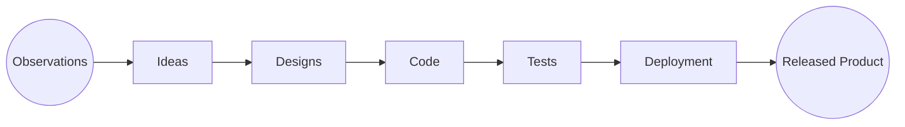
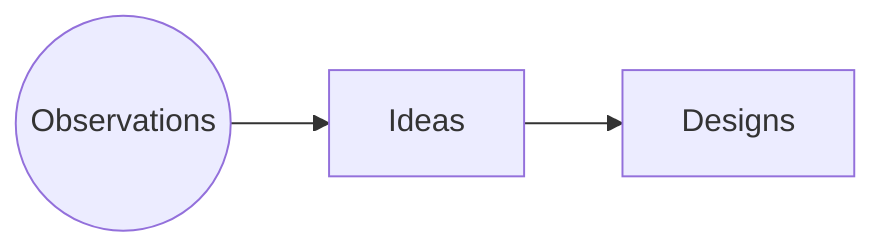
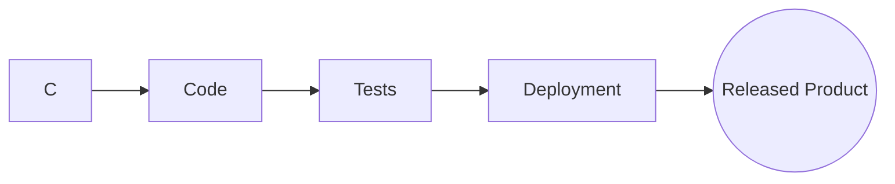
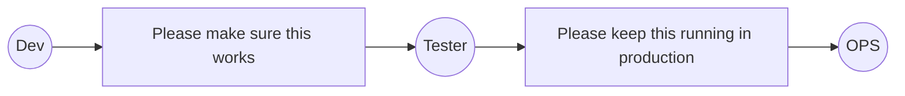
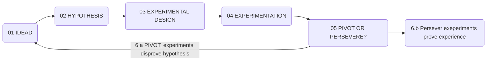

# Continuous Delivery & Devops - Week 1
Cours de Alex Cowan - University of Virginia
Lien: https://www.coursera.org/learn/uva-darden-continous-delivery-devop
## The importance of Velocity & The Jobs of Delivery
### Why is velocity important ?
Increase Velocity = How fast can you and your team go from some observation about something that would be valuable to the customer. Graph of velocity:
Objectif du cours:
Pouvoir s'asseoir à la table avec tout le monde et être capable de :
- Faire une esquisse de la pipeline actuel 
- Comment la décomposer, la rendre meilleur et comment faciliter ce genre d'idées et ces priorités.
- Comment réduire la charge de la pipeline pour l'optimiser et montré qu'inverstir du temps dans une pipeline pour l'amélioré la rendra plus sainne, faire travailler l'équipe de manière plus saine et peu à peu se débarasser de l'inutile pour avoir une base hautement hiérarchisée.

### What is a delivery pipeline ?

#### Continuous design:

High-quality Ideas:
On obtiens pas de trés bon résultats d'une livraison continue sans idées testables de haute qualité. Si l'on en a pas, on a pas la capacité de livré rapidement un client avec des résultats positifs, on aura juste le résultat d'être. Si ce que l'on veut c'est un produit, ça fait plus d'argent, les utilisateurs l'aiment plus etc. ce sera difficile de les obtenirs si l'on a pas d'idées testables de hautes qualitées. Sans des idées testables de hautes qualitées ça vas être compliqué de ce concentré sur ce que l'on a besoin de tester dans l'objectif d'un déveoppement continue.

#### Continuous delivery pipeline:

Start with a new code product by a developper .
```mermaid
graph LR
A((New Code))
A --> B[Commit & Small (Unit) Tests]
B --> C[Medium (Integration) Tests]
C --> D[Large (System) Tests]
D --> E[Manual Validation]
E --> F[Deployment]
F --> G((Released Product))
```
On commence par des petits tests puis des moyens et ensuite des grands. C'est une partie crucial pour une bonne pipeline.
Unit Tests: Test une petite partie du code (`called A`), un petit test individuel qui test une fonction. L'objectif c'est de tester très rapidement et spécifiquement.
Integration Tests: Tester les fonctions qui utilise `A` pour s'assurer que tout fonctionne ensemble.
System tests: Tester vraiment comment l'utilisateur viendrait utiliser le système quand il est dans le champs de ce qui à été développer. On a besoin de savoir ce qui se passe à ce moment là.
Avec tout ça on étend notre gamme de tests et on est bien plus précis et efficaces pour ne pas avoir à fix des bugs h24.
Manual Validation: A faire sur chaque commit, toujours avoir des review. Faire des tests d'exploration, à la main par exemple.
Deployment: Mise à niveau de l'application dans un magasin d'apps , ou déploiment de logiciels sur le web...
Tout ça forme une pipeline de référence. 

### What is a test stack ?
**Unit tests**: Sont presque toujours crées par le développeur quand il écrit son code. Se sont des tests très isolés. Ils sont là uniquement pour tester ce morceau de code sur ce qu'il est censé faire et qui sont des tests rapides. Le mieu est d'avoir un bouton sur lequel on vas appuyer (job pendant la CI) pour executé un ensemble de tests et ensuite savoir ce qui vas et ce qui ne vas pas et où exactement.
**Integration tests** / **Component Tests** : L'objectif c'est de tester si les autres fonctions qui intéragissent avec les units tests fonctionnent biens. C'est ce qui vas généralement révelé les bugs. 
**System tests**: 
> Functional tests
> Non-Functional tests
> Acceptance tests
> Contract tests
> End-to-end tests

Performances tests, tests de charges, tests avec beaucoups d'entrées. Il faut s'assurer que ce soit évolutif. C'est aussi là où on fera des tests de sécurités.

Avec ça on obtient des tests qui sont plus longs, qui vont fournirs moins d'informations immédiatement exploitables, moins proche du developper . C'est logique mais si un Unit tests ne fonctionne pas, tout ne fonctionne pas, mais un développer saura où est l'erreur et aura une meilleur intuition sur ce qui pourrait être mal et tout ça sur des tests qui seront vites exécutés en quelques secondes.
Parce-qu'avoir le temps d'aller prendre une tasse de café et de le boire c'est trop long pour fix un bug. On obtient une récompense en investissant<br>
Plus on vas loin plus in vas avoir à tester les limites entre les fonctions et le système dans son ensemble.

Units tests = Small tests
Integration tests = Medium tests
System tests = Large Tests.

| Feature | Small | Medium | Large |
| --------- | ------ | ---------- | ------- |
| Network access | No | Localhost Only | Yes |
| Database | No | Yes | Yes |
| File System Access | No | Yes | Yes |
| Use External Systems | No | Discouraged | Yes |
| Multiple Threads | No | Yes | Yes |
| Sleep Statements | No | Yes | Yes |
| System Properties | No | Yes | Yes |
| Time Limit (seconds) | 60 | 300 | 900+ |

Dans le tableau toute les features ne font pas de small tests, parce-que l'objectifs d'un small test est d'être isolé de tout ça. Pour tester tout ça on vas fake ("mock / stub") nos intéraction entre la fonction et une autre, c'est un investissement nécessaire dans les units tests parce-que c'est ce qui permet de tester rapidement une fonction, on l'isole.
Le problème principal de n'avoir que des Larges tests c'est que l'on risque de se retrouver avec des faux positifs, on a des tests hors de propos et des choses qui devraient cassés qui ne cassent pas, la plus par du temps c'est seulement le test qui est cassé et ce n'est pas ce que l'on veut.
La clé c'est: On ne voudrais jamais avoir un problème qui serais découvert en System test que l'on pourrait avoir détecter en Unit test.

### What is Devops ?
#### Classic processus:

Le problème c'est que ça demande beaucoup de monde, beaucoup d'attention, beaucoup de réflexion, beaucoup de but, pour obtenir un travail interdiciplinaire correct. Le Dev a beaucoup de pressions pour sortir de nouvelles features, le tester doit s'assurer que tout fonctionne bien et parfois ils n'ont pas assez de temps pour les tester donc introduire du retard dans le processus et encore plus si il faut faire plus de tests pour ne jamais être surpris. Et l'OPS qui recevra tout ça n'importe quand en fonction de n'importe quoi. Tout ça ce n'est pas la manière de faire la plus optimal.

---
DevOps c'est comment faire mieu avoir plus de finalité et plus de réflexion. Un département DevOps s'occupera de créer une plate-forme d'intégration continue ou de livraison continue que les équipens peuvent ensuite utiliser en libre service comme bon leur semble. Ce sont également les conseillers des autres équipes. 
Avoir du DevOps permet à une entreprise d'avoir des relations interdisciplinaires conçues d'une manière qui a un sens et qu'il y a des rétrospectives autour d'eux sur comment tout le monde travaille ensemble et est-ce que tout le monde travaille vers un résultat commun que nous voulont avoir.
Le second axe important c'est l'automatisation, l'automatisation c'est s'assurer que tout les tests sont biens fait à chaque tour de Pipeline (pour augmenter la santé de la pipeline et supprimer du travaille pénible).
> Reducing hand-offs
> Working together more effectively as an interdisciplinary team
> Breaking down silos
> Focusing on more automation
> Conducting retrospectives

## How do teams work together to improve their pipeline ?
### The Job of Development and DevOps:
Dans l'innovation on a un résultat que l'on veut obtenir et nous avons besoin de passer par un nombre d'incertitude pour avoir ce résultat. La nature du travail change beaucoup pour s'éloigner de cette ancienne façon pilotée par un plan, basée sur les exigences et de se basé sur une façon plus adaptative de faire les choses où nous comptons travailler en petits lots avec beaucoup de tests au fur et à mesure.
Le manifest agile:
**Individuals interactions** > **Processes tools**
**Working software** > **Comprehensive documentation** (Une documentation complète signifiant vraiment des exigences et des spécifications et de grands plans normatifs à long terme). 
**Customer collaboration** > **Contract Negotiation** (Il est plus important que l'équipe dans laquelle je travail obtient le résultat que nous voulons, plustot que de devoir respecter des deadlines horribles et faire un travail baclé)
**Responding to change** > **Folowing a plan** (arrivé à un bon résultat sur une base changeable est la façon d'obtenir de bons résultats dans le monde de l'innovation que de rester coincé par un plan fixe)

DevOps est une adaptation spécifique pour le travail entre ces trois roles:
Développeur, testeur et Ops. DevOps c'est la façon dont ces gens traveillent spécifiquement ensemble.
Les tests unitaires sont principalement réalisés par le développeur (cela peut-être en visualisant les outputs en sorti de CI sur gitlab par exemple) ainsi que le développement basé sur des données probantes et des tests. Avant les tests était éffectuer par des supérieur parce-qu'on trouvais qu'un dev qui fait ses tests c'est comme un renard qui garde un poulallier, ils ont besoin de quelq'un pour les garder honnêtes (c'est une manière de dire qu'un dev n'est pas aussi éxigeant avec son code qu'il devrait l'être). Mais c'est éronner, parce-que si c'était le cas, nous devrions corriger la façon dont tous ces gens travaillent ensemble. Ce que l'on veut de nos jours c'est un environnement où tout le monde aide tout le monde à faire ce qui a du sens.
Entre l'Ops et le développeur la relations aussi à beaucoup évoluer dans le sens où les programmes ne sont plus livrés mais sont des services. Les programmes ne sont plus transmis aux client ou gravé sur des CD, maintenant tout est dans le cloud. Le développeur deploie le logiciel avec l'Ops dans le bâtiment ou à l'intérieur de l'entreprise. Ce qui fait en sorte que l'Ops ne soit plus appelé à deployer quelque chose à 2heure du matin puisque tout est sur les serveurs. Donc le développeur est beaucoup plus impliqué aujourd'hui dans l'exécution de leur logiciel pour le compte de leur entreprise, parce-que c'est plus simple avec une bonne technique mais aussi parce-que c'est bien plus économique de pouvoir faire un rendu immédiat d'un logiciel aux clients.
Pour résumé: Le travail d'un DevOps est de créer un environnement où ces choses sont naturelles, où il y a de quoi observer et explorer et ou nous sommes en mesure de mettre des bases en place où l'équipe est capable de mieux converger et s'efforcer d'atteindre un résultat commun.

### The Job of Test and DevOps:

Le test est quelque chose de très imortant dans le DevOps, le test es la nouvelle planification. Le tests esty la seule manière d'avoir une capacité de livraison continue réelle. 
Le developer fait des Units tests ce qui fait un très bon lien entre les développeurs et les testeurs. L'idée d'une livraison progressive est que nous avons une infrastructure sur laquel on peut envoyer du contenu mais désactivé, le client lambda ne peut pas l'utiliser mais un certain public si et regarder ce qui se passe en production. Souvent le "tester" travail aussi sur l'infrastructure pour la gestion de son implémentation des tests dans la pipeline pour une fonctionnalité donnée et de maintenir l'infrastructure de test globale, particulièrement aux System tests. 
Black-box testing: on test le logiciel avec une entrée en connaissant la sortie que l'on veut (plus proche du System testing) . White-box testing: tout le reste, où l'on tests avec le logiciel réellement implémenté (plus proche du dev avec les units tests & les tests d'intégration). Exploration testing: prendre une idée, regarder comment ça a été implétmenter dans le logiciel et voir la mise en oeuvre réelle et de la tester en s'assurant que c'est correct. Il existe deux écoles pour le test:
1. Legacy tests: appelé assurance qualité ou dernier test. C'est l'idée que cette chose qu'est le test, ce fait à la toute fin du cycle de développement, histoire d'être sur que ça va avant de push en prod. 
2. Test toujours: Plus cohérent avec l'idée générale de DevOps, où les tests sont intégrés dans l'équipe ou interagissent plus fluidement avec l'équipe et ils coach plus la team en mode plus interdisciplinaire et plus inretactive par rapport au tests. 

### The Job of Ops and DevOps:
Ops : Conciste a créer des ressources pour exécuter le logiciel et maintenir ce logiciel en cours d'execution, màj, paquets, OS, qui le support. Le problème c'est que l'ops doit aller faire tout ça sur chaque serveur un par un, ce qui est fastidieux, ancieu et risqué. 
L'objectif du DevOps est de créer une infrastructure plus standardisée, plus automatisée et qui met tout à jour en permanence en ce qui concerne "le logiciel".  L'Ops doit maintenant créer une infrastructure commune qui a du sens pur tout le monde qui leurs permet de mettre à jour leurs ressources ou dans ajouter, de s'assurer que "le logiciel" fonctionne bien. Le DevOps prefère aussi ne plus mettre en place des serveurs physiques, on passera pas un fournisseur, un tiers (Amazon, Heroku, Google Cloud ...) pour executer "le logiciel" parce-que c'est devenu trop lourd d'avoir sa propre infrastructure physique et de mettre les OS à jour, gérer les pannes réseaux. Economiquement c'est aussi plus simple que ce soit un tiers qui s'en occupe, ça réduit la charge de travail sur site et c'est moins riqué. Le DevOps s'assure de la bonne santé de l'infrastructure globale.

Phrase a retenir: Le DevOps est un mouvement interdisciplinaire généralisé.
Ingénieur de fiabilité de site SRE : Travail spécifique qui est très proche de l'ops du point de vue de l'ingenieurerie.

### Your Delivery Pipeline - Getting Started
Facilitier l'interaction entre les membres de l'équipe. 
#### The product manager: 
est en charge de la partie `Observations -> Ideas -> Design`, Il a deux objectifs:
1. Créer des expaces pour permettre à l'équipe de cultiver sa capacité de livraison. Pour ça il ne doit pas trop entasser de contenu à chaque sprint. 
2. Il a besoin de créer des inputs de bonne qualités. C'est important dans l'idée de rendre les idées plus testables. Un outil utile est l'histoire de l'utilisateur Agile (Agile user stories). C'est un bon moyen de focus le design en en parlant avec l'équipe et en réfléchissant à la façon dont on vas l'implémenter dans le logiciel.

"As a [persona], I want to [do something] so that I can [realize a reward]"
- Persona: Une vision humanisée de qui est notre utilisateur.
- Do something: Like find a special mark for cat food
- Realize a reward: Acheter la nourriture du chat.
L'objectif c'est d'avoir une histoire d'utilisateur en se mettant a sa place, lui demandé de faire quelque chose et tester pour voir si on obtient ce que l'utilisateur voudrais ou si on y arrive pas. 

#### Le dev:
1. Investir dans une bonne couverture de tests, pour savoir si notre logiciel fonctionne tout de suite plustôt que d'avoir des bugs non isolé. Ca aidera a refactoriser ou à amélioré notre code de manière plus performante. Ca reduit la dette technique et aide a avoir une base de code en meilleure santé et donc notre pipeline en meilleure santé. 

#### Le tester:
DevOps est vraiment bon pour lui puisque tout le monde se concentre vraiment sur les tests et lui attribue de l'importance. 
1. Comment pouvons-nous vraiment être plus réfléchis dans nos tests et comment commencer à les automatiser ?

#### L'Ops: 
Comment rendre les déploiements plus fluides ? (Infrastructure as code plustot que d'avoir une tonne de serveur sur lesquels travaillez manuellement) L'infrastructure est le propre produit de l'Ops, il faut voir comment améliorer / Automatisé cette dernière étape de la pile et créer plus d'environnement en libre-service pour que les autres personnes de l'équipe qui veulent déployer du code dans l'infrastructure.

#### Comment savoir si ça fonctionne:
1. Velocity: Si la vélocité est faible, sommes-nous capables d'être plus perforrmant ?
2. Inderdiciplinarité: Est-ce que le transferts entre toutes les personnes impliquées dans notre pipeline et entre toute c'est personnes est-ce que les interfaces entre eux fonctionnent ?
3. Est-ce que ce que l'on se déplace vers un code saint et est-ce qu'il est déployé, opéré par un controle de version et est-ce que l'on à dépot d'artéfact fonctionnant au fur et à mesure que nous passons à travers la pipeline. 
4. Tout ce que l'on créer et que l'on déploie est sauvegarder de manière configuré par un controlleur de version et assez visible de cette façon ?
5. Est-ce que l'on a un dépôt d'artefact où nous testons toujours la même chose que nous passons à travers la pipeline et en fin de compte vers le déploiement ? 

Réponse Quiz 1:
1 - team learn valuable
2 - Testing
3 - improve focus 
4 - Test idea quicker
5- tout sauf longer perio
6 - tout sauf improve utilization rates
7 - exact same thing
8 - Agile user stories
9 - Version
10 - Implementing processes

# Continuous Delivery & DevOps - Week 2

## How do you focus your testing? Create unit tests?
### The Science and Economics of Testing:
Il faut voir les tests comme une expérience en n'oubliant pas que on aura beau faire le amximum, on ne peut pas tout tester. 
#### The science of testing: 

01: Do I have a basis to think this idea is worth testing ? Ici on pensera que tout test que l'on vas faire vaut la peine. (On doit apprendre a notre équipe ce qui vaut le coup ou ce qui ne le vaut pas)
02: What exactly do we want to have happen and how will we know if it does/doesn't? Avoir une idée vérifiable de ce que cela signifie. Comment saurons-nous si ce test apport de la valeur au programme ou non ?
03 / 04: What are the right test investments ? Are we running this test in the right way at the tight times ? Faisont-nous le bon type d'investissements sur ce test ? Dans quel et pourquoi test instissons-nous ? Comment peuvent-il nous aidés ? La vélocité augmente ? Est-ce que les actions manuel et répétitives vont diminués ? 
05 / 6.a: Est-ce que notre idée fonctionne bien ? Est-ce que nous devons retravailler notre idée ? Ou super ça marche continuon !

#### The Given-when-then pattern
Plan de project parfait sur la façon dont on vas mettre à jour notre infrastructure de test ? L'idée c'est de prendre en exemple une histoire d'utilisateur:
`As Ted the technician, I want to create an account so I can try out the system.`  et de lui appliqué ce pattern :
```
Given [a circumstance],
When [the user do something]
Then [expeccted change in state]
```
Dans notre pattern ça donne:
```
Given [Ted does not have an account],
and [he is on the sign-up form]
When [he enters his email]
and [he enters his passord]
and [he confirms his password]
and [he submits the form]
Then [an account is created on Firebase]
and [the navigation shows an option to 'Log Out']
and [the login window is no longer visible].
```
Il exist un outil appelé Cucumber qui prend en compte se genre de syntax en input et qui permet aux dev et au testeurs d'écrir une fonction `Step` pour exécuter des tests sur notre scénario.

Pour faire de bon test il faut penser a la fois comme:
1. un designer : Qu'essayons-nous de fournir à l'utilisateur, et comment utilons-nous cela pour concentrer nos tests dans cet environnement où nous ne pouvon bien sûr pas tout tester ?
2. un ingénieur: décomposer, automatiser, les tester et travailler systématiquemennt desus.
3. un economiste: Quel est la conséquence si une certaine chose par rapport à une autre chose se casse et combien une certaine chose prendr de temps et d'énergie a une équipe.

Favoriser la collaboration interdisciplinaire pour arriver à un programme de test qui a du sens pour l'ensemble de la pipeline.

### How many tests ?
Il y a trois différences en les tests de la "Test Stack" (Unit / Integration / System):
1. (Time) Le temps qu'il prenne pour executer les tests augmente plus on arrive sur les System tests. C'est pour ça que lorsque l'on est au System tests, on veut qu'un développeur ai déjà passer du temps et a investi de l'énergie dans les Units tests dans une CI / CD sur laquelle il n'aura qu'a envoyer son code pour le faire tester. On ne veut pas qu'un dev ai le temps d'aller boire un café et faire autre chose parce-qu'il sera plus dur pour lui de se remettre la tête dans le boulot et donc a fixer les bugs. 
2. (Isolation) On ne veut jamais catch un bug dans les system tets que l'on aurai pu attraper au units tests ou aux Integration tests parce-que la qualité de l'information sortante (le bug) sera moin clair/fourni. L'isolement des parti du code tester doit réduir en montant dans la pile. 
3. (Cost) Le coût (chronophage / argent) augmente beaucoup au fur et à mesure que l'on monte dans la pile parce-qu'il y a beaucoup qui se passe au niveau des tests System.

Ordre d'idée, ca diffère en fonction de l'application)
System tests: 10 tests sur une application moyenne, en faisant ce que ferrais un utilisateur. 
Integration tests: 20
Unit tests: 70

Outil pour tester: Selenium (pour les system tests). Prend souvent la tête aux devs. 

Anti-patterns (que l'on veut éviter) :
- Ice cream cone pattern. C'est ce qui arrive quand les devs n'invesissent pas assez de temps dans les tests, on se retrouve avec un gros paquet de test au niveau system et peut de units test. Problème tests Selenium que les dev aime pas, ça prend du temps, c'est chouette au début mais quand c'est trop c'est lourd. 
- Hourglass pattern: C'est quand il y a pas ou peu d'Integration test. que tout les tests sont des units test (ça c'est bien), mais trop en system tests (ça pas bien).  On sait que l'on a un problème de ce côté là quand on attrape quelque chose au system tests que l'on aurait pu attraper à l'Integration tests. 

Feature flags: Fonctionnalité qui sont désactivées quand elles sont à la production. Ce qui peut être pratique si on veut activer ces fonctionnalité seulement pour certains utilisateurs en interne et les testers.

### Zoom on the Small / Unit Test:
Test tools:
- Java: JUnit
- JavaScript: Jasmine
- Python: Mock
C'est outils créés une infrastructure et aide au mocking & stubiing et aide au maintient des tests.
Il exist aussi des outils pour savoir quel est le pourcentage de code couvert pas des tests unitaire et qui donne un pourcentage, ce qui permet aux équipe de savoir si leur objectif d'avoir une bonne couverture de test est atteint. 
Pour savoir si les tests unitaires mis en place sont suffisant, il est important de regarder ce qui est fournit à l'équipe et à la pipeline, pour chaque itération individuelle, convient. A la fin de chaque Sprint on fait un rétrospective et on demande qu'est-ce qui s'est bien passé et que voulons nous changer ? 

### Zoom on the Medium / Integration Test:
Tricky part:
1. Il est plus facile de dire que devrions avoir un très bon test d'intégration et faire réellement une sorte de dépendance externe que vous devez contrôler.
2. Qui vas faire ce test ? On doit être capable de comprendre la question du langage de programmation (White-box). La réponse dépend vraiment des personnes que l'on a dans l'équipe a ce moment là. 

Vraiment éviter le problème du sablier.

### Zoom on the Large / System Test:
L'essentiel reste que l'on veut toujours pousser vers le bas de la pile les tests. 
Les System test sont vraiment important pour les applications qui sont faite a base de microservice. 
C'est séparé en deux, on appel ça faire du sous-cutané (subc / sub-cutane),
la partie UI (utilisateur) et la partie API. On vas basé nos tests au maximum sur la partie API pour intéragir le moins possible avec cette chose fragile qu'est l'UI.

On doit ce concentré sur; Qu'est-ce qui doit abosolument fonction pour que l'on soit sur que ça fonction ? Qu'est que l'on peut pourrais pousser plus bas ? Histoire de pouvoir se dire à un maximum d'endroit: Osef, c'est tester plus bas.

On reprend le Given-When-Then model pour s'assurer de la viabilité de nos inputs de bases. Ca permet aussi de se dire: quite à prendre du temps autant que ce soit avec un scénario pousser. Mais pour les action sur l'UI on aura plustot d'entande à faire un action "global" plustot que "spécifique" (ex: "He submits the form" instead of "He pushed the button").

El famoso Selenium: (Pas fan parce-que dès que l'on fait un changement sur un composant, faut modifier aussi dans le test, surtout quand ce n'est pas le testeur qui les faits) C'est un webdriver qui automatise les interactions avec l'interface utilisateur. Il y a aussi un IDE qui est un plugin.
Il existe aussi Nightwatch.js

L'objectif global c'est: Minimiser l'empreinte de ces tests, maximiser l'utilisation des outls disponibles et qu'est-ce qui necessite une refonte pour la testabilité ? Et qu'est qui ne pourrais pas être fait plus bas dans la stack. 

### Curlture of experimentation:
Les tests: Pourquoi ? Ca va augmenter la vitesse et réduire les erreur que l'on a à traité. L'idée c'est "Testing is the new planning".
L'innovation: Les plans devraient être simple et travaillant vers un résultat et très motivé par les tests.
Pour rester focus, la meilleur solution est de tester les idées, le logiciel, tester au fur et à mesure que l'on avance de manière réfléchie.

Reponse Week 2:
1. Unit
2. Integration
3. System
4. closly associated
5. prelevant or critical
6. You cannot test everthing
7. Given-When-Then
8. Hourglass
9. ? It's not important - On ne doitpas economiser sur les tests.
10. Feature flags 

# Continuous Delivery & DevOps - Week 3

## Infrastructure and The Jobs of Ops:
### The 99% of your code you don't write:
Référence au fait que l'on utilisera plus souvent des librairies ou des choses déjà existante pour que ça fonctionne. Pourquoi refaire quelque chose qui existe déjà ? Utiliser des choses déjà existante = coût plus faible et de la maintenance supplémentaire à faire. 
Un bon ensemble de ces choses déjà existante est une partie de plus en plus importante du développement de logiciels et aide a standardiser tout ça et en lui donnat un endroit pour fonctionner correctement et le garder opérationnel, sont généralement les taches d'un Ops. 
Deux choses à mettre en place: 
1. Serverless architecture: L'idée c'est qu'aulieu d'avoir nos propres serveur physique et de les mettre quelque par, de les exploiter et de les posséder, il est économiquement plus évolutif d'utiliser les infrastructures d'un tiers totalement automatisée, énormer et de les louers (GCP, AWS, Azure...). 
2. Infrastructure as code: Plustot que d'écrir trois pages qui décrivent comment configuré et maintenir les serveur avec ce que l'on veut etc. on vas écrir un fichier de configuration qui décrira notre infrastructure et nous permettra de l'automatisé. (Terraform) Repetable, scallable, et moins térrifiant qu'une doc complète en forme de pavé et moins d'erreur. 

